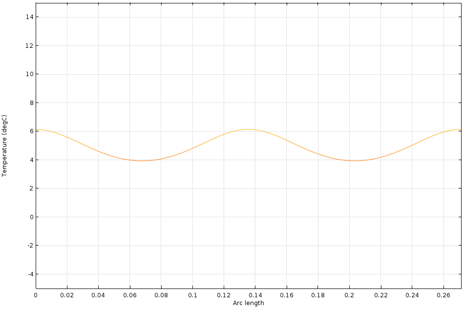
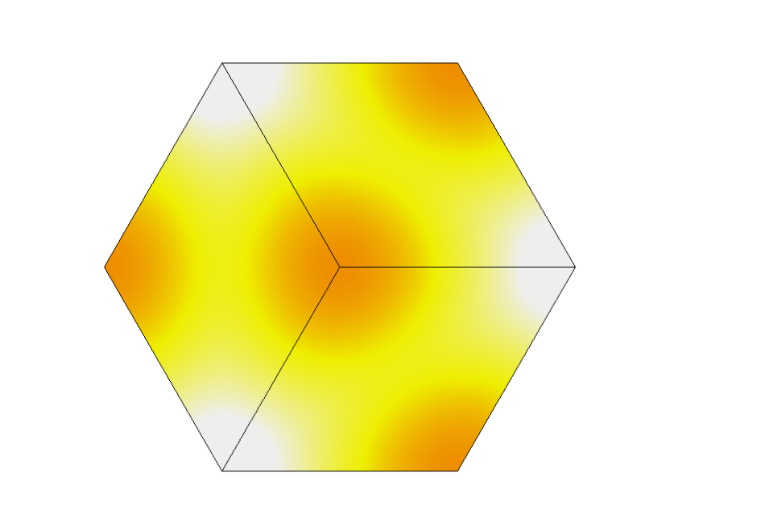
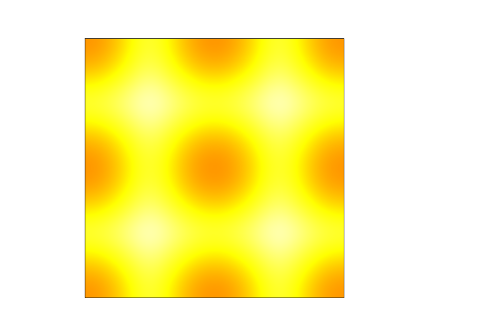
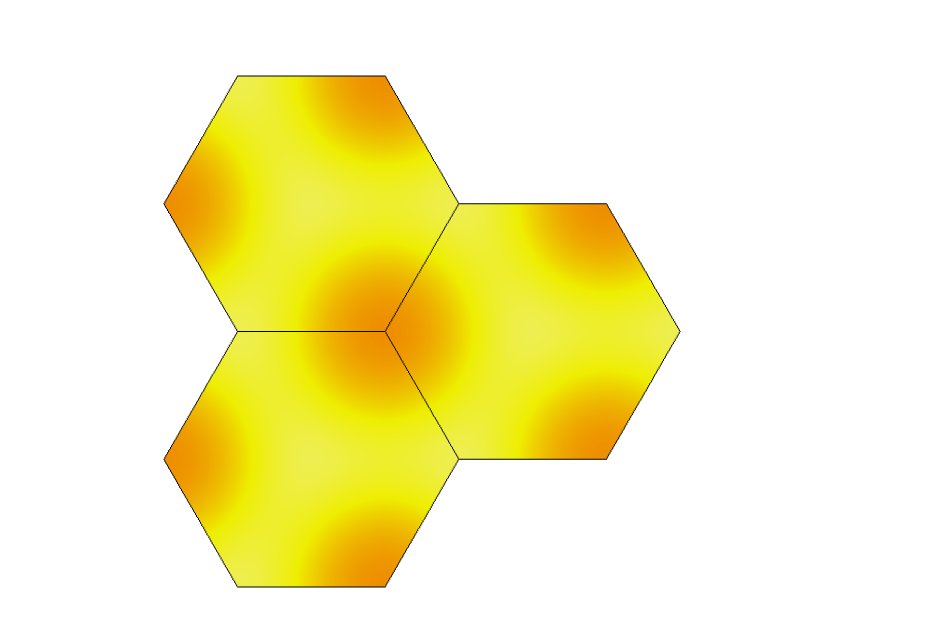
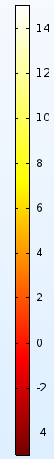
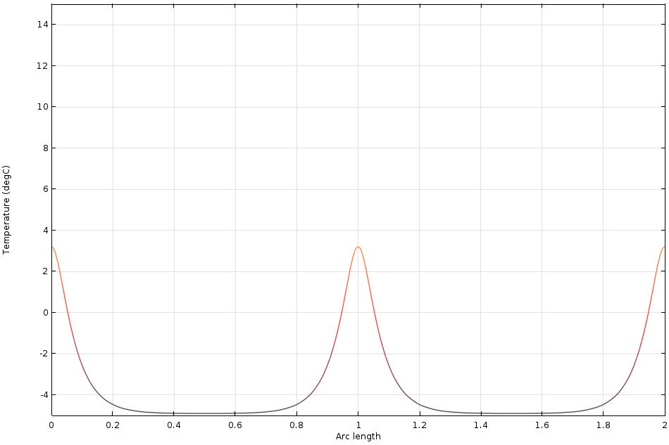
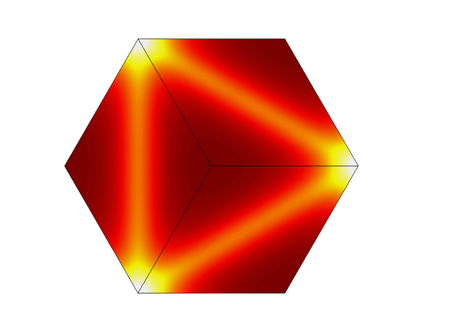
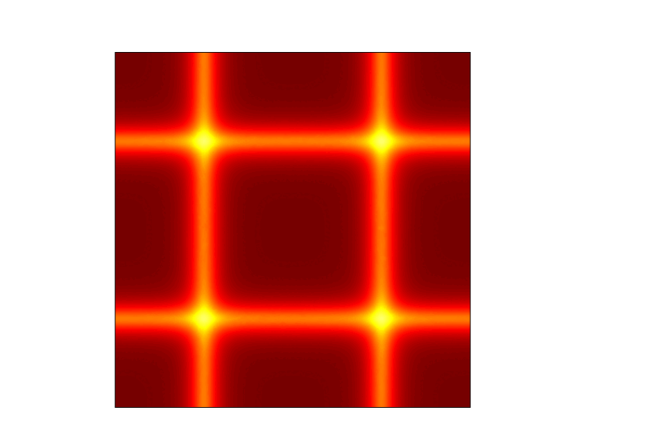
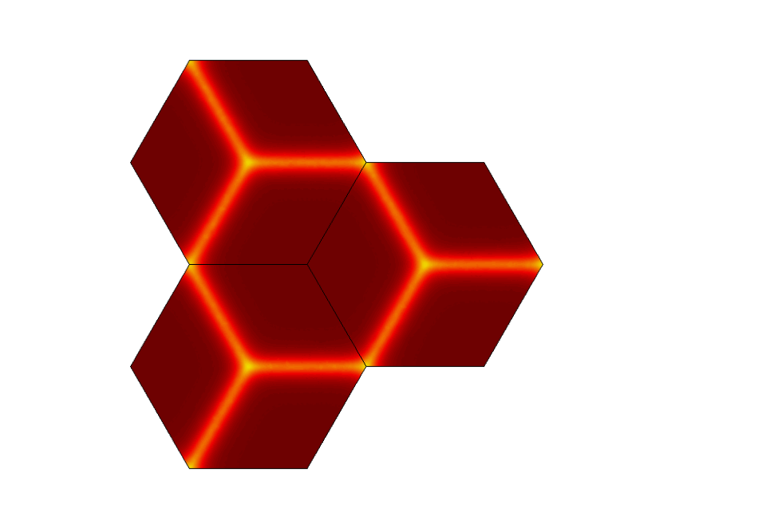

# Efficient Road Heating System Design

Which heating-cable layout melts snow off a road for the least cable?

Buried electric heating cable warms a road from underneath. Where you run the cable decides where the cold spots land, and cold spots are where snow survives. Four layouts get compared here in COMSOL: straight parallel runs, equilateral triangle, square, regular hexagon. Each one is packed tight enough that every point of the road surface reaches 4 °C, and then they're judged on how much cable that took per square metre.

CAE coursework at Hanyang University, 2023. Two-person team; I did the modelling and the analysis, my teammate put the slides together.

## Setup

Identical across all four models.

| | |
| --- | --- |
| Asphalt thermal conductivity | k = 1.4 W/(m·K) |
| Asphalt density | ρ = 2400 kg/m³ |
| Asphalt specific heat | Cρ = 900 J/(kg·K) |
| Pavement thickness | 100 mm |
| Cable burial depth | 45 mm |
| Cable diameter | 7.5 mm |
| Cable output | 40 W/m |
| Initial asphalt temperature | −4 °C |
| Temperature at the bottom of the asphalt | −4 °C |
| Ambient air | −10 °C |
| Air heat transfer coefficient | 2.5 W/(m²·K) |
| Design criterion | every point of the surface ≥ 4 °C |

Sources for those numbers: asphalt properties from the FHWA pavement thermal page, omnicalculator, and Bučinskas et al., *Towards the Efficient Way of Asphalt Regeneration by Applying Heating and Mechanical Processing*, p. 2. Pavement thickness and burial depth from enerpia.co.kr and 교면포장 설계 및 시공 잠정지침 (국토해양부, 2011). Cable diameter and output from enerpia's `Snowmelting_cable(specification).pdf`. Convection coefficient from ScienceDirect.

## Method

Each layout has one parameter that controls how tightly the cable is packed: spacing between runs for the straight pattern, side length for the other three. Call it *s*.

1. Coarse sweep, *s* = 1.0 m down to 0.1 m in 0.1 m steps, recording the minimum and maximum surface temperature at each step. This brackets the 0.1 m window where the minimum crosses 4 °C.
2. Fine sweep of that window in 0.01 m steps.
3. Fit a quadratic to minimum temperature against *s* over the fine sweep and solve it for 4 °C.
4. Run the model once more at that exact *s* to check the fit landed where it should.

The fitted curves

| Layout | Fit over the fine sweep | Solved at 4 °C |
| --- | --- | --- |
| Straight | y = 474.94s² − 220.55s + 25.173 | s = 0.1356 m |
| Regular hexagon | y = 736.95s² − 315.49s + 31.882 | s = 0.1247 m |
| Square | y = 212.94s² − 162.84s + 28.683 | s = 0.2083 m |
| Equilateral triangle | y = 101.52s² − 118.69s + 32.365 | s = 0.3349 m |

Cable length per unit road area follows from dividing the pattern into repeating cells and dividing the cable inside one cell by the cell area. It comes out as a constant over *s*: 1 for straight runs, 2/√3 for the hexagon, 2 for the square, 2√3 for the triangle.

## Results

Surface temperature at each layout's critical spacing. Shared colour scale, −4 °C to 15 °C:

| Straight | Equilateral triangle |
| --- | --- |
|  |  |

| Square | Regular hexagon |
| --- | --- |
|  |  |

| Layout | Critical *s* | Min. surface temp there | Cable per unit area |
| --- | --- | --- | --- |
| Straight | 0.1356 m | 3.94 °C | **7.37 m/m²** |
| Regular hexagon | 0.1247 m | 4.01 °C | 9.26 m/m² |
| Square | 0.2083 m | 3.99 °C | 9.60 m/m² |
| Equilateral triangle | 0.3349 m | 3.98 °C | 10.34 m/m² |

Straight parallel runs win, and not narrowly: 7.37 against 9.26, 9.60 and 10.34 m/m².

Coarse sweep, s = 1.0 m → 0.1 m

| Straight | Equilateral triangle |
| --- | --- |
|  |  |

| Square | Regular hexagon |
| --- | --- |
|  |  |

One other thing came out of the sweeps. Minimum surface temperature rose with cable length per unit area at roughly the same slope for every layout, whatever the pattern shape. We left it there, but there's room to look into it.

## What's in here

| File | |
| --- | --- |
| `Line.mph` `Triangle.mph` `Square.mph` `Hexagon.mph` | The COMSOL models, one per layout |
| `line-sweep.xlsx` and the other three | Coarse and fine sweeps for that layout, with the quadratic fit |
| `sweep-summary.xlsx` | All four coarse sweeps side by side, with cable length per unit area |
| `*-sweep.gif` | The coarse sweep as an animation |
| `*-surface-temp.png` | Surface temperature at the critical spacing |
| `CAE-presentation.pdf` | The course presentation the numbers above come from |

COMSOL Multiphysics with the Heat Transfer module. Open a `.mph` directly: geometry, materials, boundary conditions and the study are all in the file.
